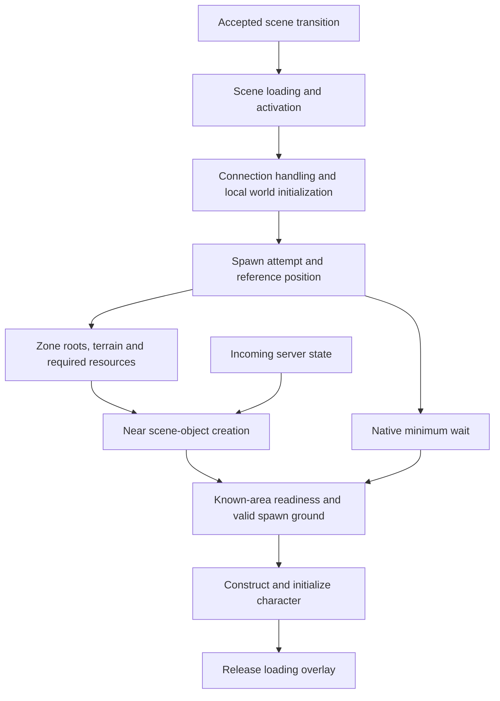

# Why joining a Valheim world can take more than 30 seconds

Research reference for analysis, future optimization and external discussion.
Last updated: 2026-09-15. Native code inspected: Valheim **1.0.12**, Unity
**6000.0.75f1**. Revalidate method contracts and assumptions after game updates.

### Executive finding

A long loading screen is a dependency chain: scene activation, local world
initialization, network-state arrival, zone preparation, object creation, spawn
validation and finally the loading overlay. It is not one thirty-second file
read, and character construction is not the dominant cost in our observations.

Native scheduling and readiness gates can leave the client waiting even when
the individual readiness checks are cheap. Increasing CPU thread count alone
does not remove these dependencies. The strongest measured experimental result
so far comes from servicing native zone preparation more frequently during the
initial load, while retaining native readiness checks.

**Evidence boundary:** the mechanisms below were inspected in the installed
vanilla assemblies. The timing captures used BetterPerformance and existing
mods, including ValheimPlus and BetterNetworking. They are **not an unmodded
vanilla benchmark** and do not establish that every vanilla world takes thirty
seconds. Headless tests also exclude graphical rendering costs. Findings are
specific to the inspected build, fixture and conditions unless stated otherwise.

### What the stopwatch measures

Our join timeline begins when the client accepts the scene-transition request.
It ends when the native loading overlay is first observed released. Process
startup, menus, earlier connection/authentication delays and user interaction
before that request are outside this interval. A rendered and responsive first
frame is a separate endpoint that headless tests cannot verify.

The native `Spawned after` log measures accumulated game `dt` during the respawn
attempt. It is not the same clock or starting point as total wall-clock loading.
Likewise, a measured method duration is not necessarily exclusive CPU time.

### The loading dependency chain

This is a dependency diagram, not an assertion that all network/terrain work
starts at the depicted boundary. Work overlaps, and fallback spawn branches
can repeat parts of the process.

One representative baseline trial partitions as follows. Consecutive milestone
differences form elapsed phases; they do not assign every millisecond to a
specific native method.

| Phase | Approximate wall interval | Elapsed | Interpretation |
| --- | --- | ---: | --- |
| Accepted transition → scene `Awake` | 0.000–1.660 s | 1.660 s | Scene-transition portion in this headless trial |
| Scene `Awake` → respawn processing starts | 1.660–11.468 s | 9.808 s | Connection handling, local initialization and scheduling; requires child timing attribution |
| Respawn starts → spawn point accepted | 11.468–29.394 s | 17.926 s | Overlapping preparation and repeated readiness/minimum-wait checks |
| Accepted point → character initialization returns | 29.394–29.446 s | 0.051 s | Native player construction and callbacks |
| Character initialized → overlay observed released | 29.446–30.419 s | 0.974 s | Remaining completion/UI progression; not established as removable delay |

The endpoint is **30.419 seconds**. The statement “the character appears at
29.4 seconds” therefore does not mean character deserialization took 29 seconds.
Another earlier trial ended at 37.617 seconds, illustrating why one run should
not be treated as a stable universal loading constant.

### Local generation inside connection handling

On the inspected client path, `ZNet.RPC_PeerInfo` initializes local world data.
The server providing a world does not eliminate all client-side generation.
`WorldGenerator.Initialize` constructs deterministic world structures, including
lake, river and stream work. `AltBiomeWorldData.VerifyBiomeData` then handles
biome points and sectors.

In the earlier 0.4.1 capture, the peer-info call took **8.262 s inclusive**;
world initialization accounted for **2.824 s** inside it. Subsequent 0.4.2 probes
measured biome verification at **5.14–5.55 s** across four separate trials.
These different captures support the bottleneck attribution; they must not be
combined into an exact single-run accounting equation.

One 0.4.2 baseline spent 5.207 s in biome verification, including 4.167 s in
point generation and 0.543 s in sector generation. Other nested work includes
cache handling. Subtracting children from a parent does not isolate disk time.

An RPC scope can therefore be slow because it performs local initialization.
A large `RPC_PeerInfo` duration alone is not evidence of slow packet transit,
insufficient LAN bandwidth or a server that took the same time to respond.

### Why an existing biome cache may not help

The native cache filename uses the world name. Its loader compares the stored
world-save version with the client's `m_worldVersion`; the inspected filename
and validation do not bind the cache to the world seed or UID.

On the observed client path, the world-save version remains **0**, distinct
from the world-generation version received through connection handling.
`VerifyBiomeData` regenerates if data is absent **or the world-save version is
not 41**. Thus even a successful version-zero cache read does not imply that
generation is skipped.

Our shared-directory test directly observed a cache header containing 41 while
the client expected 0, followed by a false cache result. A client and server
sharing the path can therefore encounter version mismatches. Normal installations
with separate paths need their own evidence; cache existence alone proves neither
a hit nor reuse. The code's intent is unknown: this must not be described as a
confirmed accidental bug or fixed by blindly changing a header.

A safe independent cache needs world identity, algorithm/version/input validation,
integrity checks and exact-output testing. Details, including native method
evidence and deterministic-state concerns, are in the
[biome-cache investigation](native-biome-cache-research.md).

### Zone scheduling delays near-object creation

`ZoneSystem.Update` services local-zone demand on an approximately 100 ms cadence.
The inspected `CreateLocalZones` returns after its first successful new-zone
registration. A failed attempt may be waiting on terrain or resources; it does
not mean the client should ignore readiness.

For the tested nonclassic effective radius of five, the native radius predicate
selects **97 zone roots**. `ZNetScene.CreateObjectsSorted` checks
`IsActiveAreaLoaded` before preparing near-object creation; if false, it returns
early. This creates a serial dependency: near objects can wait for the larger
zone-root set, even when the player's immediate position looks simple.

Ninety-seven successful registrations at roughly one per 100 ms suggests a
scheduling scale near ten seconds under that condition, **not a fixed ten-second
tax**. Some roots may already exist, work overlaps the minimum wait, cadence is
frame-dependent and failed resource/terrain attempts can lengthen the process.
Do not multiply this estimate into a second additive delay.

Observed scene occupancy plateaued near 1,130 instances while near creation
consumed almost no measured time and never reached the preparation boundary.
Those observations are consistent with the native early-return gate. Increasing
the object creation budget cannot help that specific stage until the gate opens.
After roots become ready, creating many scene objects is a separate bottleneck.

View-distance labels alone are insufficient for comparison. Record the actual
effective radius, graphical settings, synchronized mod settings and changes
during play. The 97-root result applies to the tested radius, not every preset.

### The eight-second wait and spawn safety

The observed native respawn minimum was **8 game-time seconds**. In the relevant
logout-point branch, the reference position is set before the minimum is tested,
allowing preparation to advance during that interval. After the minimum,
`IsAreaReady` and ground/spawn checks can continue rejecting the point.

These checks were individually inexpensive. Their repeated false results
represent waiting for dependencies; their accumulated execution time does not
measure the wall time spent waiting. Our new reason counters distinguish
minimum-delay-consistent returns, unloaded zones, a loaded zone whose known
objects are not ready, other branches and successful readiness.

Crucially, `IsAreaReady` can evaluate only state already known locally. No known
missing object is not proof that the complete required initial server state has
arrived. Removing the minimum or forcing readiness true without a stronger
completion barrier could release the character too early. Our prototype does
neither. Failed ground, logout-point or bed checks can also lead to retries or
fallback spawn behavior beyond the path measured here.

### Why parallelism is only part of the answer

Unity already overlaps some scene/resource loading work. Main-thread integration
and Unity object lifecycle calls remain constraints; the native terrain builder
also already has a worker. Its observed worker time must not be added to elapsed
main-thread phases. Unity's loading priority changes the main-thread integration
allowance. [Unity loading priority](https://docs.unity3d.com/6000.0/Documentation/ScriptReference/Application-backgroundLoadingPriority.html).

Candidate pure calculations may be moved to bounded workers only after proving
ownership and deterministic equivalence. Native biome flood-fill order, sector
lists, subsequent shuffling, global random state and mutable river caches matter.
Matching biome counts or a visually similar map is not sufficient. Unity's global
random API is not a general background-worker generator.
[Unity Random](https://docs.unity3d.com/6000.0/Documentation/ScriptReference/Random.html).

More threads cannot directly fix a one-success-per-update scheduler or a readiness
dependency. Caching, improved scheduling and overlapping independent work may
offer larger gains before rewriting algorithms for parallel execution.

### Experimental evidence and remaining unknowns

A QA-only initial-loading prototype allowed up to four native local-zone calls
per service opportunity, under a soft time budget. Two comparisons changed
30.419 → 24.895 s and 31.729 → 27.487 s. The direction reproduced, but two pairs,
uncontrolled host contention, fixed ordering and headless execution do not
establish an ordinary-gameplay guarantee or a vanilla-versus-mod effect size.
Full conditions, safety checks and limitations are in the
[experiment report](fast-join-results-0.4.2.md).

Still unresolved or outside present coverage:

- A fully unmodded timing baseline and graphical first-responsive-frame latency.
- Cold disk/process startup versus a warm cache or resident-world reconnect.
- Complete initial-network-state arrival and its causal contribution to readiness.
- Different spawn environments, large bases, world ages, presets and mod sets.
- Shader/GPU/resource integration costs under normal graphical execution.
- The exclusive cost of native cache writing and the exact benefit of valid reuse.
- Whether a proposed deterministic cache/worker preserves every relevant state
  transition across versions and other generation patches.

For future comparisons, preserve the fixture identity and boundaries, record
effective settings, separate inclusive method costs from milestone intervals,
retain cache outcome and readiness coverage, and report CPU contention, memory
and frame tails alongside loading duration. Preloading must account for work
done before the stopwatch. **A 1–10-second join remains a research objective.**

### Reference map

- [Loading telemetry definitions](loading-telemetry.md)
- [Earlier 0.4.1 measured timeline](loading-runtime-0.4.1.md)
- [Native zone scheduling analysis](loading-fast-start-research.md)
- [Native biome-cache contracts](native-biome-cache-research.md)
- [0.4.2 experiment and installed diagnostics](fast-join-results-0.4.2.md)
- [Future loading architectures and validation constraints](fast-loading-frontier-2026-09-15.md)

No proprietary game source, game binaries, raw captures, save files or player
identifiers are embedded in this document. Native method names and behavioral
summaries provide anchors for authorized local revalidation.
